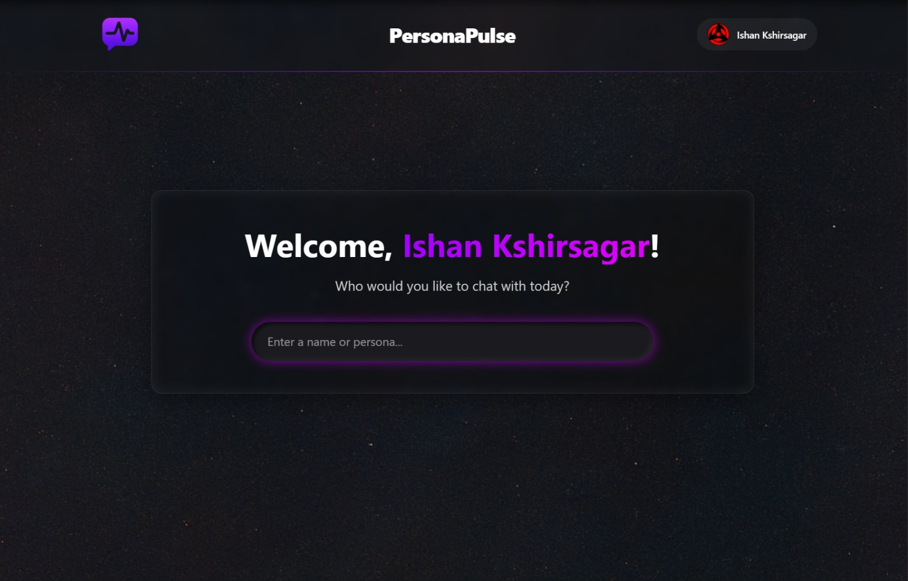
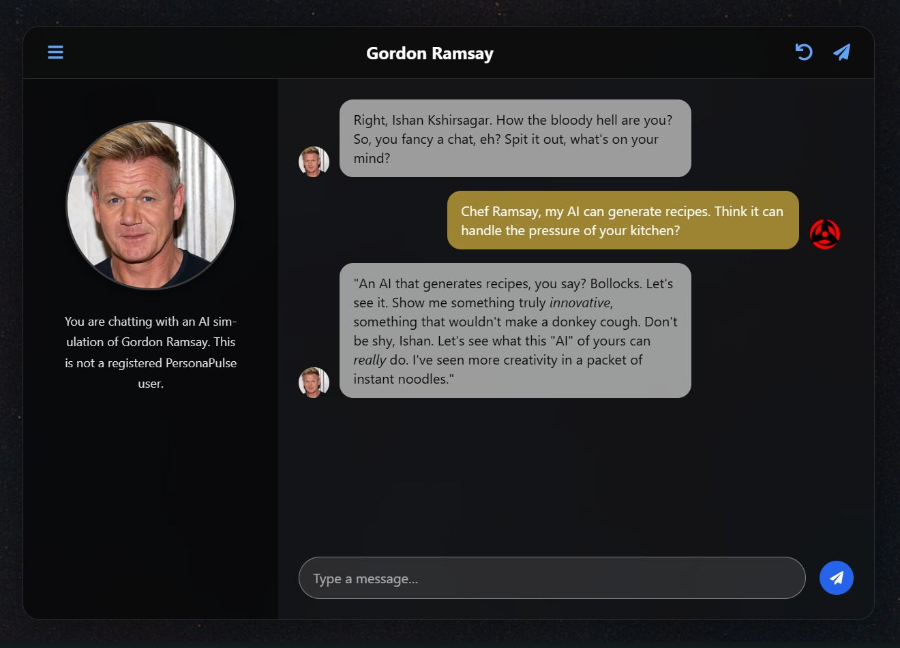
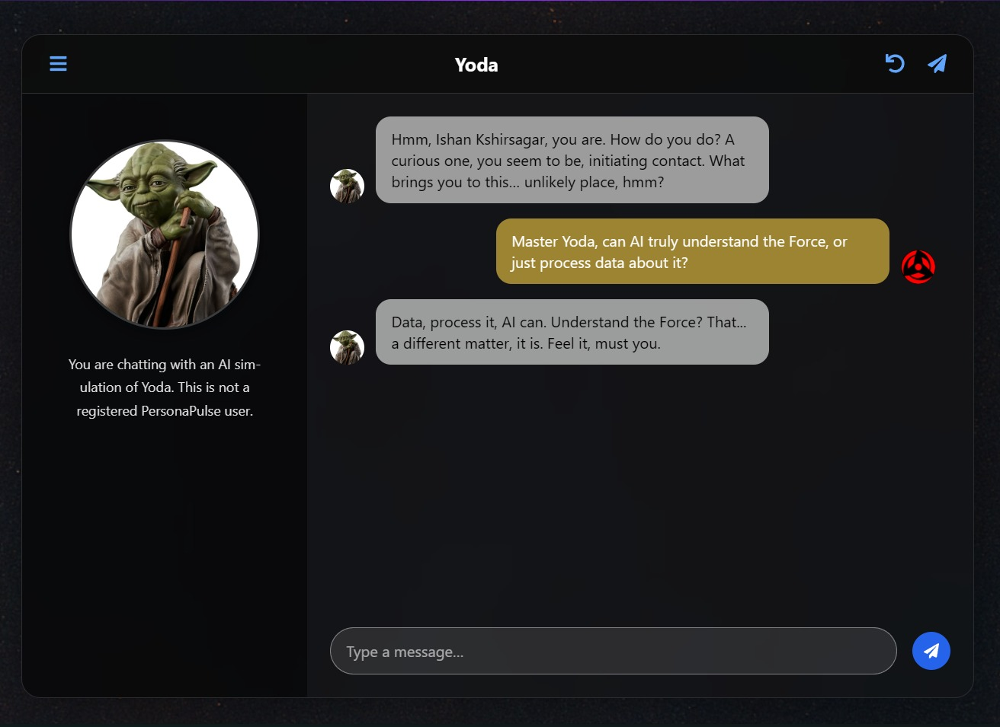

# PersonaPulse  ⚡: Your Digital Twin, Powered by AI

**Craft your unique vibe into a conversational AI assistant! PersonaPulse lets you build a personalized AI chatbot that learns, adapts, and chats just like you.**

---

**Live Demo:** [https://persona-pulse.vercel.app/](https://persona-pulse.vercel.app/)

---

## :rocket: Overview

In a world increasingly driven by digital interaction, PersonaPulse explores a fascinating question: Can AI not only understand our words but also capture the essence of our personality and communication style? This project is my answer – an attempt to create AI "digital twins" that offer a uniquely personal and engaging conversational experience.

PersonaPulse empowers users to:
*   **Define Their Digital Self:** Through an intuitive onboarding wizard, including a unique "Vibe Check" and a "Dream Conversation" with any imagined persona, the AI learns the nuances of the user.
*   **Chat with Their AI Twin:** Interact with an AI that reflects their personality, shares their interests (as defined), and communicates in their style.
*   **Explore & Connect:** Discover and chat with AI personas created by other users or dynamically generate AI versions of public figures, all within a sleek, modern interface.

This project represents a solo endeavor into full-stack development, AI integration, prompt engineering, and building interactive, user-centric applications.

## :sparkles: Key Features

*   **Personalized AI Persona Creation:** A 5-step onboarding process designed to capture personality, interests, and conversational style.
*   **"Dream Conversation" Engine:** A core feature where users chat with an AI emulating any chosen famous persona, allowing the system to learn their unique communication patterns. This data is then used to help shape their own AI persona.
*   **Interactive Chat UI:** A rich, responsive chat interface for seamless interaction with AI personas, complete with dynamic sidebar context.
*   **Persona Discovery Dashboard:** Search and engage with other users' AI personas or create on-the-fly "dream chats" with public figures using real-time AI generation.
*   **Secure Authentication:** Powered by Supabase for email/password and Google OAuth.
*   **Dynamic Sidebar Content:** Sidebar information adapts based on whether you're chatting with your own bot, another user's bot (highlighting similarities), or a dream persona.

## :camera_flash: Screenshots

  
   <em>Dashboard: Search for Personas</em>

   
   <em>Engaging with AI-Generated Dream Personas</em>

---

## :hammer_and_wrench: Tech Stack

*   **Frontend:** React, TypeScript, Vite, Tailwind CSS, shadcn/ui, React Router, Framer Motion
*   **Backend:** Python, FastAPI, Google Gemini (Pro & Flash models)
*   **Database & Auth:** Supabase (PostgreSQL)
*   **AI & NLP:** Prompt Engineering for Gemini, Web Scraping (`googlesearch-python`, `trafilatura`) & Summarization for "Dream Persona" context.
*   **Deployment:** Vercel (Frontend & Backend Serverless Functions)

---

## :thinking: Challenges & Learnings

Building PersonaPulse as a solo developer was an ambitious and deeply rewarding endeavor. Key challenges and learnings included:

*   **Complex State & Async Logic:** Managing the flow of data and UI updates through multi-step onboarding, various chat initiations (self, other user, dream persona), and asynchronous API calls required careful state management design in React and robust error handling.
*   **Nuanced Prompt Engineering:** Iteratively refining prompts for Google Gemini was crucial to achieve accurate persona emulation, contextually relevant sidebar summaries (especially those comparing user similarities), and coherent, engaging conversations.
*   **Full-Stack Debugging:** Tracing issues often meant navigating the entire stack – from a frontend type error to a backend API timeout or an unexpected LLM response. This honed my skills in holistic system diagnosis.
*   **API Design for Performance:** Initially, a single backend endpoint handled too much, leading to timeouts. Refactoring to separate endpoints (e.g., for initial chat messages vs. sidebar content generation) significantly improved responsiveness and reliability.
*   **OAuth & Deployment Configuration:** Ensuring secure and functional Google OAuth across local development, Supabase, and Vercel deployment (especially with redirect URIs) was a meticulous but essential process.

This project pushed me to not only apply my existing skills but also to rapidly learn and adapt, particularly in designing for complex AI interactions and ensuring a seamless user experience despite the underlying complexities.

---

## :crystal_ball: Future Enhancements

PersonaPulse has a strong foundation, and here are some exciting directions for future development:

*   **Shareable Persona Links:** Allowing users to share a direct URL for others to chat with their AI.
*   **Advanced Persona Editing:** Giving users more granular control to fine-tune their AI's personality, knowledge, and conversational style post-onboarding.
*   **Voice-Enabled Conversations:** Integrating speech-to-text and text-to-speech for a more immersive experience.
*   **Persistent Dream Chat History:** Allowing users to save and resume their "dream chats" from the dashboard.
*   **Knowledge Base Integration:** Enabling users to upload documents or connect data sources to give their AI persona specific knowledge.

---

## :bulb: Conclusion

PersonaPulse stands as a testament to the power of modern AI and full-stack development in creating deeply personalized and engaging digital experiences. As a solo project, it represents a comprehensive exploration of building an end-to-end application that tackles complex challenges in AI interaction, user experience design, and system architecture.

The journey of developing PersonaPulse has been incredibly insightful, pushing the boundaries of what I thought possible to build independently. It has equipped me with invaluable experience in prompt engineering, API design for AI services, and the intricacies of integrating sophisticated AI models into a user-friendly web application.

I believe projects like PersonaPulse are not just technical showcases but also reflections of a passion for innovation and a drive to leverage technology to create unique and meaningful connections. I'm excited about the potential of such personalized AI and eager to contribute my skills to building the next generation of intelligent applications.

---
